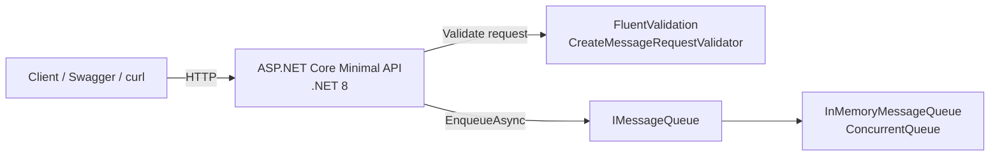
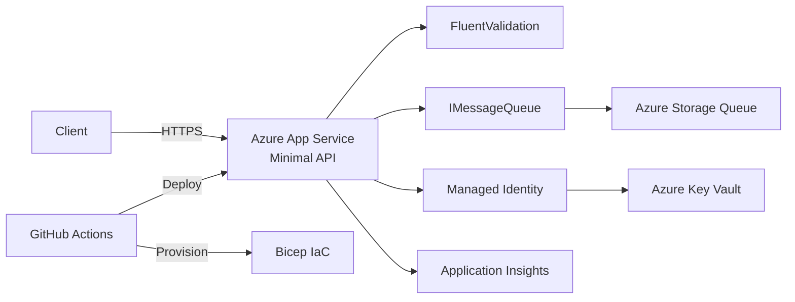

# Architecture

## Current local architecture (B3.E0)
The current implementation is intentionally small and local-first:
- ASP.NET Core Minimal API hosts HTTP endpoints.
- Request payloads are validated using FluentValidation.
- Message submission flows through `IMessageQueue` abstraction.
- `InMemoryMessageQueue` is the active implementation in E0.
- No Azure resources are required for local execution.

### Mermaid - current local architecture

## Future Azure architecture preview
The target architecture will keep API contracts stable while swapping local infrastructure for Azure services:
- API hosted on Azure App Service.
- Queue abstraction implemented using Azure Storage Queue.
- Secrets/config handled through Managed Identity + Key Vault.
- Observability expanded with Application Insights.
- Infra managed with Bicep and automated through CI/CD.

### Mermaid - future Azure architecture preview

## `IMessageQueue` explanation
`IMessageQueue` defines a stable application boundary for message enqueue operations. The API endpoint depends on the interface instead of a concrete provider, so queue infrastructure can be replaced without rewriting endpoint logic.

## `InMemoryMessageQueue` explanation
`InMemoryMessageQueue` is a temporary E0 implementation that uses process-local memory only. It enables endpoint flow and validation testing now, while keeping migration to Azure queue services straightforward in later milestones.

---

### AI delivery guideline
Issues are useful for traceability, but AI implementation prompts should be **self-contained, explicit, and verifiable** instead of relying on the model to read a specific issue comment.
